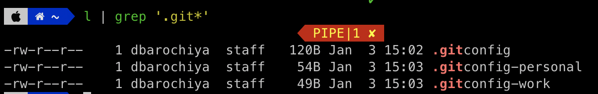

# How to handle multiple git configurations in one machine

> Want to manage work and personal git profiles on one machine ?


You might get hard time manging many cats but when it comes to git profiles there is something we can do

Let's get straight to the solution - The answer lies in the `.gitconfig` file - this is starter point for the git to identify what configurations needs to be used. The idea is to segregating the repos on your machine into  multiple directories by separating the profiles you want with and then define `.gitconfig` file per profile. 

---

## Step 1 → create separate directories for repos

This is where you start - organise the projects that you are working on into separate folders by the profiles you want to work with. For example let's say there are two git profiles you are working, this use case would represent most of us.   

- `WORK` → for work related projects
- `PERSONAL` → for open source and side projects

## Step 2 → create global git configuration

Create the global `.gitconfig` file into your home directory if it doesn't already exists and add all the profile directories as an entry like the below file. It is very much intuitive what it does - if your directory path where you create the git directory matches with one of the path in `inclideIF`  then use that particular profile specific configuration file otherwise use the default configurations. 

File → $HOME/.gitconfig

```
[includeIf "gitdir:~/personal/"]
  path = ~/.gitconfig-personal
[includeIf "gitdir:~/work/"]
  path = ~/.gitconfig-work

```

## Step 3 → create individual git configurations for profiles

If you haven't noticed by now - we have just mentioed the `.gitconfig-personal` and  `.gitconfig-work` files in the global gitconfig files but we are yet to create them. These individual files can contain all the customisation that you need to perform form user name, and email to commit hooks. 

FIle → $HOME/.gitconfig-work

```bash
[user]
 name = work_user
 email = work@email
```

File → $HOME/.gitconfig-personal

```bash
[user]
 name = personal_user
 email = personal@email
```

---

## Let's verify

Just like that we are set !!  Now you will be having three git files in your home directory.



Now we will create and intiitialie a new git repo in the work and personal directories and check the configurations. 

```bash
$ cd ~/work
$ mkdir work-test-repo
$ cd work-test-repo
$ git init
		*Initialized empty Git repository in /Users/dbarochiya/work/work-test-repo/.git/*
$ git config -l   
		*credential.helper=osxkeychain
		includeif.gitdir:~/personal/.path=~/.gitconfig-personal
		includeif.gitdir:~/work/.path=~/.gitconfig-work
		**user.name=work_user
		user.email = work@email**
		core.repositoryformatversion=0
		core.filemode=true
		core.bare=false
		core.logallrefupdates=true
		core.ignorecase=true
		core.precomposeunicode=true*                                                                                                                  
```


```bash
$ cd ~/personal
$ mkdir personal-test-repo
$ git init
	*Initialized empty Git repository in /Users/dbarochiya/personal/.git/*
$ git config -l
	*credential.helper=osxkeychain
	includeif.gitdir:~/personal/.path=~/.gitconfig-personal
	**user.name=personal_user
	user.email=personal@email.com**
	includeif.gitdir:~/work/.path=~/.gitconfig-work
	core.repositoryformatversion=0
	core.filemode=true
	core.bare=false
	core.logallrefupdates=true
	core.ignorecase=true
	core.precomposeunicode=true*
```

Voila - see the different email and user name is changed in both case. Depending on the path of the git repo it is able to use the custom `gitconfig` files.