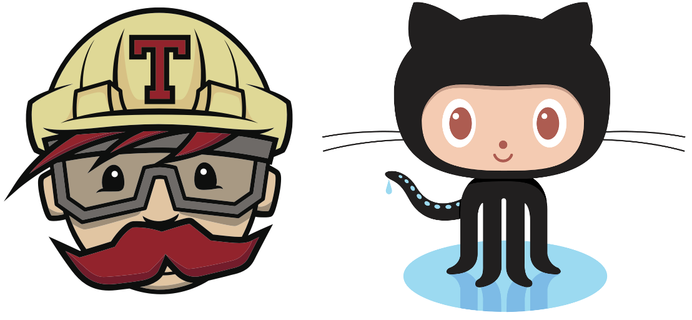
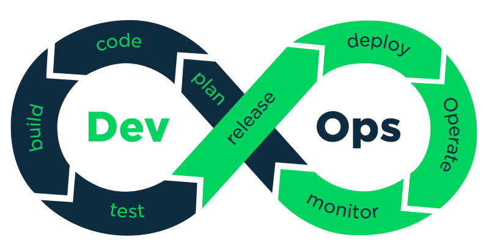
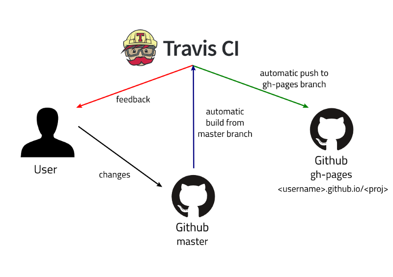
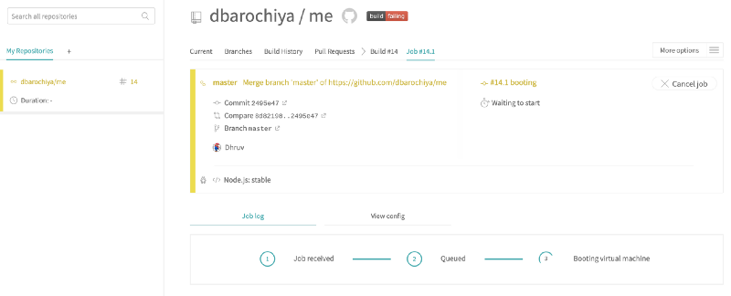
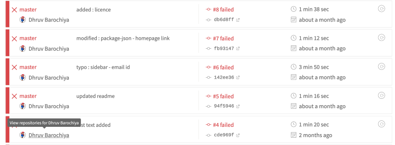
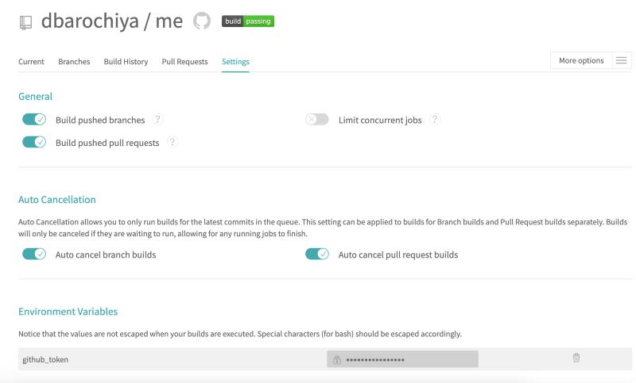

You have created a project in React.js and deployed it on the GitHub-pages (not yet ?? — [create your first project in React.js](https://medium.com/free-code-camp/portfolio-app-using-react-618814e35843)) But what if you are making frequent changes into the code base and also want to keep the deployed version updated to the latest ? … You will find yourself in the tedious process of running the deployment scripts again and again !!!

> What if the deployment process can be automated ??

After some quick google search session, I found that it is possible and can be achieved by Travis CI — an open source tool can be used to automate the deployment of various types of projects.

### What you will learn >

In this article, you will be able to learn how to implement the system which will trigger the react deployment scripts using the TRAVIS-CI to deploy the project onto the GitHub-pages whenever there are any changes found in the master branch of the code repository.

-   Setup Automated deployment of **‘**[**react-portfolio’**](https://medium.com/free-code-camp/portfolio-app-using-react-618814e35843) project
-   Learn about some frequent errors encountered while the process
-   Learn about some concepts related to ‘**continuous deployment’**

### Let’s learn some fundamentals

> Skip this section if you know you are not that type !!

#### Continuous Integration(CI) & Continuous Delivery(CD) >

> “In [software engineering](https://en.wikipedia.org/wiki/Software_engineering "Software engineering"), continuous integration (CI) is the practice of merging all developers’ working copies to a shared [mainline](https://en.wikipedia.org/wiki/Trunk_%28software%29 "Trunk (software)") several times a day” — [wikipedia](https://en.wikipedia.org/wiki/Continuous_integration)

In other words, the developers will try to merge their feature code into the master branch as frequent as possible. Following this practice enables the developers and product managers to release the product more frequently.

There are some extended versions of the CI pipelines in which these changes are also being tested automatically which makes the code deployable at any time, it’s called **‘Continuous Delivery**’. A further extension of this pipeline is called **‘Continuous Deployment’** pipeline, where these tested code changes are pushed automatically into the production servers. ( We will be implementing the continuous deployment pipeline in our case)

#### Travis CI >

**Travis CI** is a hosted continuous integration service used to build and test software projects hosted at GitHub. Open source projects can be tested without any charges !!

Travis CI can be configured by adding a `.travis.yml` file to the repository. when Travis CI has been activated for a given repository, GitHub will notify whenever new commits are pushed to the repository or any pull request is submitted then according to the rules defined in the `.travis.yml` file, Travis CI will perform the steps which can be anything — from running tests, building the application or deployment scripts. Travis CI offers a wide range of options to build the software and of course, our beloved ❤️`javascript` is one of them.

> **NOTE_:_** _Github has_ [**_student developer pack_**](https://education.github.com/pack) _available with a bunch of premium features from different platforms (Travis CI is one of them) for free to students who wish to learn new things — get your student pack now !!_

#### DevOps >

**DevOps** is a set of software development practices that combines [software development](https://en.wikipedia.org/wiki/Software_development "Software development") (_Dev_) and [information technology operations](https://en.wikipedia.org/wiki/Information_technology_operations "Information technology operations")(_Ops_) to shorten the [systems development life cycle](https://en.wikipedia.org/wiki/Systems_development_life_cycle "Systems development life cycle") while [delivering features, fixes, and updates](https://en.wikipedia.org/wiki/Continuous_delivery "Continuous delivery") frequently. The concept of DevOps is founded on building a culture of collaboration between teams.

> “DevOps is more than practice — it’s about culture”

Continuous Integration, Continuous Delivery, Continuous Deployment are some of the few key practices of the DevOps. Apart from these DevOps engineers heavily uses the power of the cloud infrastructure to make the deployment process seamless.

---

### Enough talking !!! Let’s do some action

As you have already deployed on the GitHub pages using the `gh-pages` node module, there will be a branch called `gh-pages`on the repository which holds the files which are deployed onto the Github pages servers. After the integration of the Travis CI, we would ab able to implement the system where any changes made by the user on the `master` branch will automatically trigger a build. If the build is successful, then the build scripts will be triggered which will update the `gh-pages` branch. User will be notified about the status of the build via email notifications from the Travis CI

#### Create an account on Travis-CI >

-   Go to [Travis-ci.com](https://travis-ci.com/) and [_Sign up with GitHub_](https://travis-ci.com/signin).
-   Accept the terms & conditions of Travis CI. You’ll be redirected to GitHub.
-   Click the _Activate_ button, and select the repositories you want to use with Travis CI.
-   Add authorization token ( This will be done automatically when you sign-in with GitHub)

#### Add travis.yml file into the repository >

This file contains the instructions which tell Travis-CI — what?..how?..when?

> **NOTE**: When you trigger a job in the Travis-CI, it will boot up a virtual machine with the appropriate deployment environment configured in the `_.travis.yml_`

.travis.yml file

Let’s break down the code — 

`on` : Travis-CI will automatically trigger a job whenever there are some changes made on the branch specified in this field.

`deploy` : In this filed we have declared that we will use the deployment [provider for the GitHub pages](https://docs.travis-ci.com/user/deployment/pages/) provided by the Travis-CI which is nothing but the configuration instructions for setting up the environment for deployment.

`script` : This filed contains the build scripts which will be executed while running the job. For this case that is the build script, you can also add test scrips ( code-coverage, fusion test, etc.) before the build.

`cache` : Travis-CI provides an option to cache the library files and modules which will be the constant for all the builds. Cached files can be used again by the later build jobs which decreases the end-to-end running time of the job.

#### All set >

Ohkay everything is in the place, now onwards if you commit anything on the master branch it will trigger a Travis-CI build job which will look something like in the below screenshots. You can also trigger a build manually from the Travis-CI dashboard itself.

#### But …. (there is always a but !! huh!!)

I am pretty sure your build dashboard will not look like the above one same as life has not been smooth we were told it would be 😢. There can be infinite reasons due to which your Travis-CI dashboard is full of failed builds ( I know..I have been through this)

This is the time when your most valuable “googling” skills will come handy. I will explain what all are the errors I have faced while I was trying to create a pipeline.

-   Security errors
-   Token errors
-   Just random errors (You have to get dirty & find the solution!!)

#### Token errors >

If your builds are failing due permissions error then there are high chances that there is some [problem with tokens](https://docs.travis-ci.com/user/deployment/pages/#setting-the-github-token). You need to go to the token URL [https://github.com/settings/tokens](https://github.com/settings/tokens) and see when it was used lately, if it shows **_never_** then you have found your culprit.

Follow the below steps,

-   Delete and create a new token
-   Add it to the Travis environment variables ( Go to job settings )
-   Re-try the build

#### Security errors >

There are plenty of security practices we ignore while coding & building web applications. When we run in local these security errors are not given much emphasis and often discarded as warning messages, but when we are trying to deploy the service using the Travis-CI these warnings will cause the build failure.

I will mention the errors I encountered while working on my project(I would encourage you to mention the errors you have encountered) The great thing is that most of them have their own dedicated web-pages which explain the underlying problem and offers the solutions/workarounds ( Workarounds — we all love it even knowing that we shouldn’t !! )

-   **Using target=\_blank in HTML `<href>` tag :** This is more serious security flaw than it looks. You can learn more about it [here.](https://mathiasbynens.github.io/rel-noopener/)
-   **Redundancy in HTML code**: There were many redundant tags/class names which were making the code look like junk.

Best way to prevent these errors is to install the `es-lint` plug-in in whichever text-editor you are using.

---

### Built some project? — Share it

I am trying to build a community of developers where people can share their ideas, knowledge, work with others and find other people with similar ideology to build things together. So, if you built some project and want to share it, post it on the channel.

-   Gitter channel: [https://gitter.im/weekend-devs/community](https://gitter.im/weekend-devs/community)
-   Github Organization: [https://github.com/weekend-developers](https://github.com/weekend-developers)

---

### Wrapping up

I would like to take a moment to acknowledge the work of the people who gave me the inspiration and knowledge to complete this article.

-   **Travis CI community:** for providing awesome tools for free.
-   **_My dearest friends:_** who helped me in correcting my mistakes.
-   **YOU:** for sticking around, I hope you had a productive time. Keep exploring and building amazing things!

---

 on [Unsplash](https://unsplash.com?utm_source=medium&utm_medium=referral)](./asset-9)
